### 记录一下杀戮尖塔2的mod制作过程
#### 事前准备
- 1   
使用godot（自己去github上面找喵，也可以找我要）

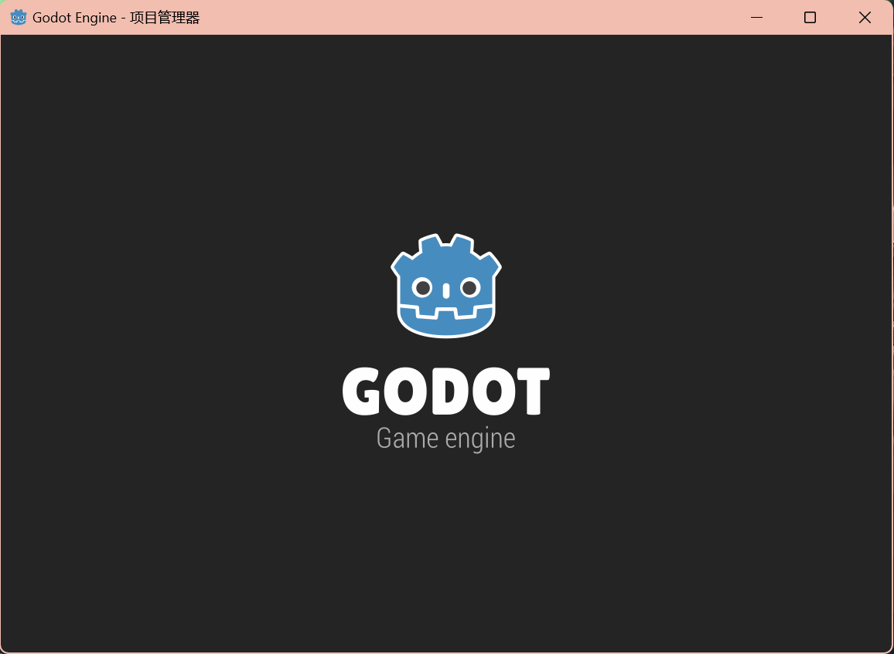
- 2
创建一个游戏项目   
注意项目名称要与你的mod名称一致，我这里就叫meihuamod好了
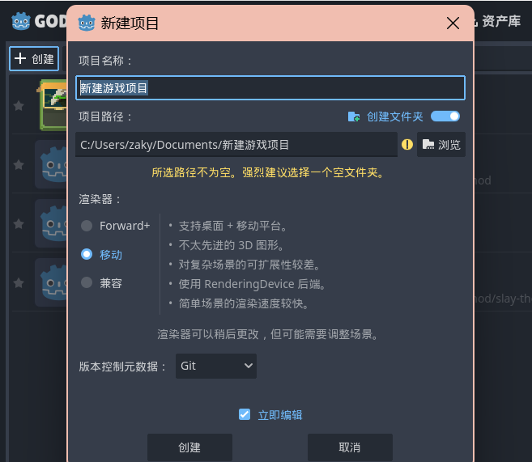
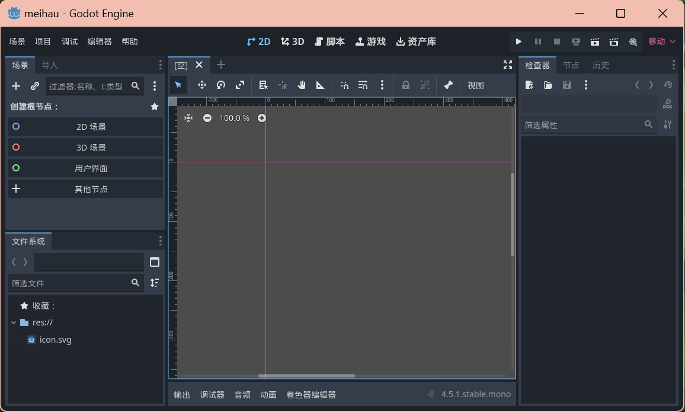
***
***
***
## 我们先来做事件的背景图
- 1背景图用不上dll，可以选择跳过   
- 用开源的杀戮尖塔2游戏文件找到events，这里有着你想要的事件。
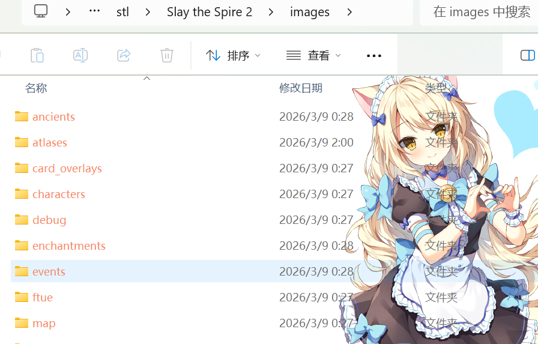
随机挑选个事件
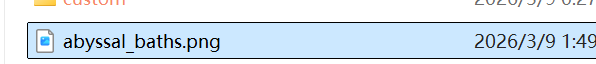
- 然后在你创建的游戏项目里做一个一模一样的
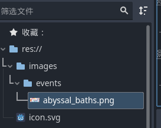
- 改好后，选择项目，导出   
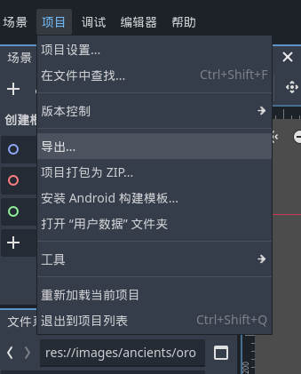
- 点击添加，这里要确认导出模式是所有资源   
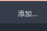
- 点击导出，把项目包为pck
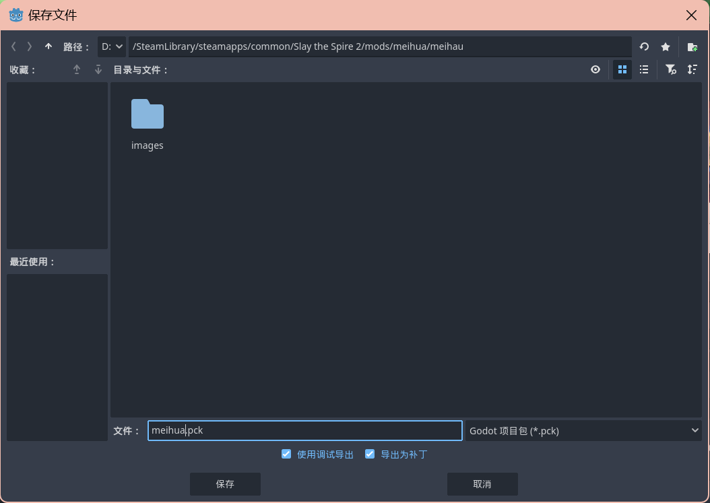
将你做的pck放到你的mod里面，还要创建一个.json文件，注意{mod}.json中,要mod名字。json文件内容如下
```
{
  "id": "MyMod",           // 必填，唯一 ID，建议和项目名一致
  "name": "我的 Mod",
  "author": "作者名",
  "description": "Mod 描述",
  "version": "1.0",
  "has_pck": true,         // 是否有 .pck 资源包,没有就改false
  "has_dll": true,        // 是否有 .dll 代码，没有就改false
  "dependencies": [""],     // 依赖的其他mod id
  "affects_gameplay": true // 多人模式时是否影响内容，如果是替换模型和优化等不影响内容的mod可填false，默认true
}
```

- 最后会有这样的形式，上号就能看到改变了
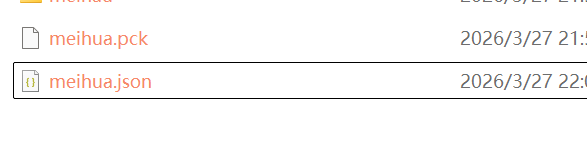

### 然后是改卡牌卡面
我们这里一样按照上面的过程
，我们用VScode做演示   

- 1   
如图，点击创建一个c#
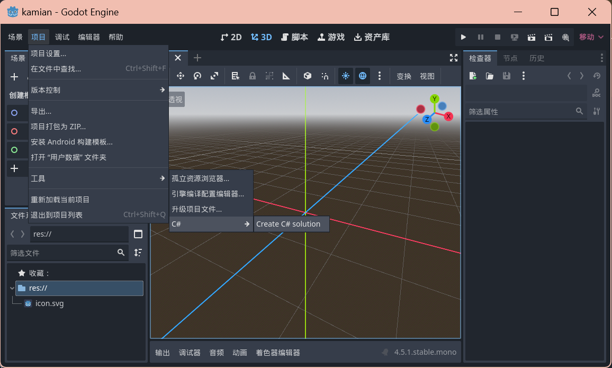
- 2
在vscode找到这个文件，修改内容为
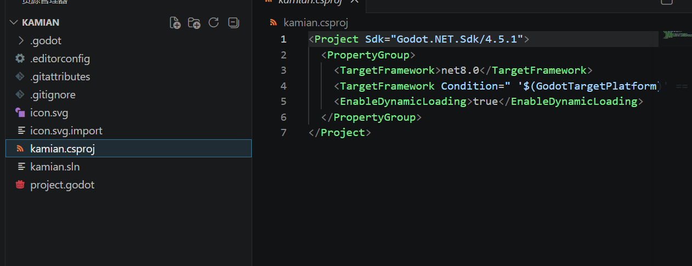
```
<Project Sdk="Godot.NET.Sdk/4.5.1">
  <PropertyGroup>
    <TargetFramework>net9.0</TargetFramework>
    <ImplicitUsings>true</ImplicitUsings>
    <LangVersion>12.0</LangVersion>
    <Nullable>enable</Nullable>
    <AllowUnsafeBlocks>true</AllowUnsafeBlocks>

    <!-- 改成你的杀戮尖塔2目录 -->
    <Sts2Dir>D:\xxx\Steam\steamapps\common\Slay the Spire 2</Sts2Dir>
    <Sts2DataDir>$(Sts2Dir)\data_sts2_windows_x86_64</Sts2DataDir>
  </PropertyGroup>

  <ItemGroup>
    <Reference Include="sts2">
      <HintPath>$(Sts2DataDir)\sts2.dll</HintPath>
      <Private>false</Private>
    </Reference>

    <Reference Include="0Harmony">
      <HintPath>$(Sts2DataDir)\0Harmony.dll</HintPath>
      <Private>false</Private>
    </Reference>
  </ItemGroup>

  <!-- 自动复制dll和json -->
  <Target Name="Copy Mod" AfterTargets="PostBuildEvent">
    <Message Text="Copying mod to Slay the Spire 2 mods folder..." Importance="high" />
    <MakeDir Directories="$(Sts2Dir)\mods\" />
    <Copy SourceFiles="$(TargetPath)" DestinationFolder="$(Sts2Dir)\mods\$(MSBuildProjectName)\" />
    <Copy SourceFiles="$(MSBuildProjectName).json" DestinationFolder="$(Sts2Dir)/mods/$(MSBuildProjectName)/" />
  </Target>
</Project>
```
- 3   
然后创建一个Scripts文件夹，创建一个Entry.cs文件（两者命名随意，为了整洁美观）。内容改成以下：

```
using Godot.Bridge;
using HarmonyLib;
using MegaCrit.Sts2.Core.Logging;
using MegaCrit.Sts2.Core.Modding;

namespace Test.Scripts;

// 必须要加的属性，用于注册Mod。字符串和初始化函数命名一致。
[ModInitializer("Init")]
public class Entry
{
    // 初始化函数
    public static void Init()
    {
        // 打patch（即修改游戏代码的功能）用
        // 传入参数随意，只要不和其他人撞车即可
        var harmony = new Harmony("sts2.reme.testmod");
        harmony.PatchAll();
        // 使得tscn可以加载自定义脚本
        ScriptManagerBridge.LookupScriptsInAssembly(typeof(Entry).Assembly);
        Log.Debug("Mod initialized!");
    }
}

```
- 4
然后在此代码下面添加新的代码
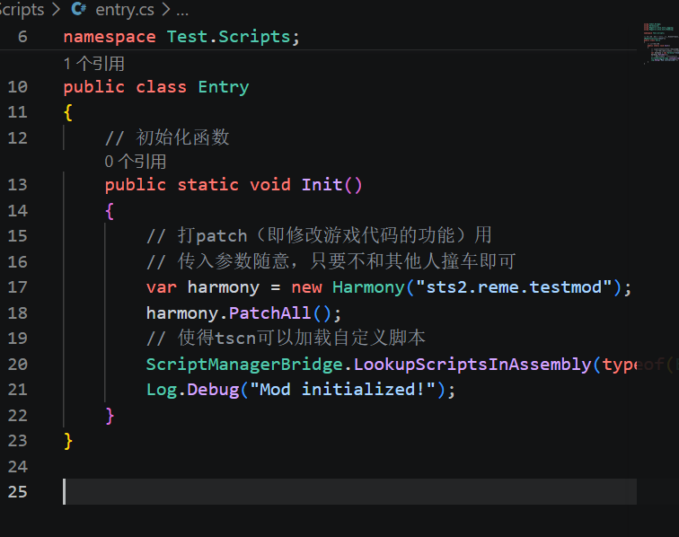
```
[HarmonyPatch(typeof(CardModel), nameof(CardModel.PortraitPath), MethodType.Getter)]
public static class CardModel_GetPortrait_Patch
{
    // 按照类名和资源路径配对即可
    private static readonly Dictionary<string, string> CustomPortraits = new(StringComparer.OrdinalIgnoreCase)
    {
        [nameof(StrikeIronclad)] = "res://test/images/image.png",
        [nameof(DefendIronclad)] = "res://test/images/image.png",
    };

    static void Postfix(CardModel __instance, ref string __result)
    {
        var className = __instance?.GetType().Name;
        if (string.IsNullOrEmpty(className)) return;
        if (!CustomPortraits.TryGetValue(className, out var path)) return;
        if (!ResourceLoader.Exists(path)) return;
        __result = path;
    }
}
```
可在此目录查看卡
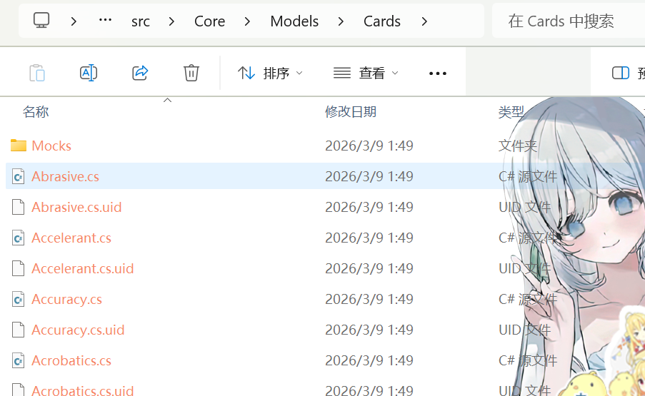
- 5
我们按照给的路径在godot创建对应的文件夹和图片即可。
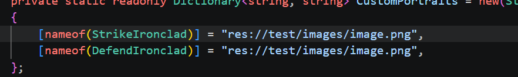

- 报错了的注意（本人犯病了喵没想到）：
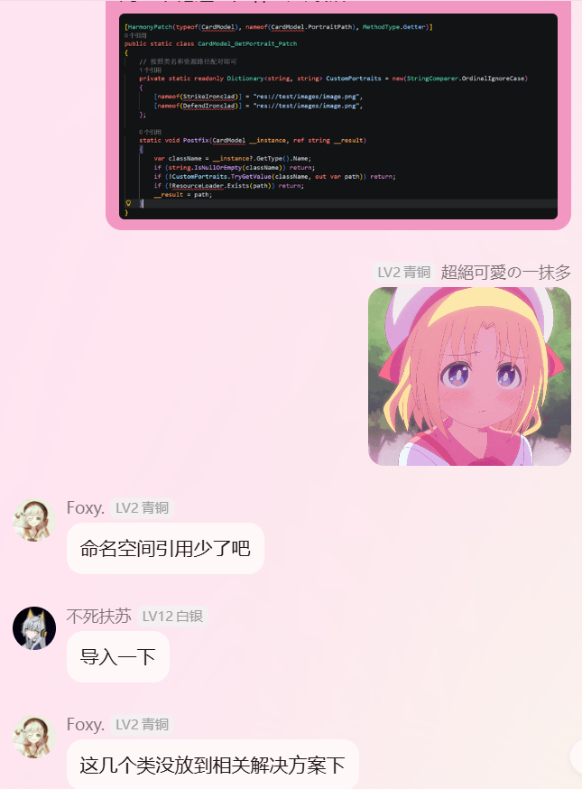
之后创建pck，dll，就可以了   

### 效果图如下
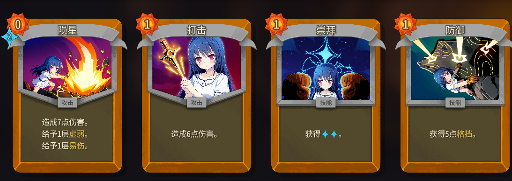
***
##### 也忙活了半天了，第一次做游戏的mod🖐️🐟️🖐️🐟️~

