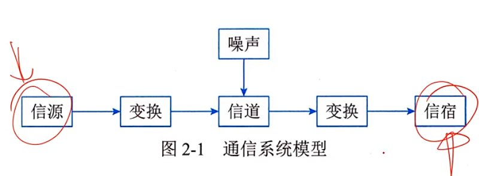
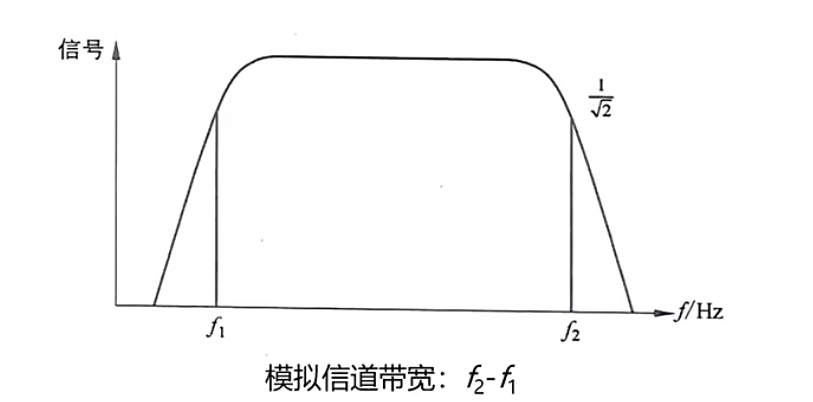
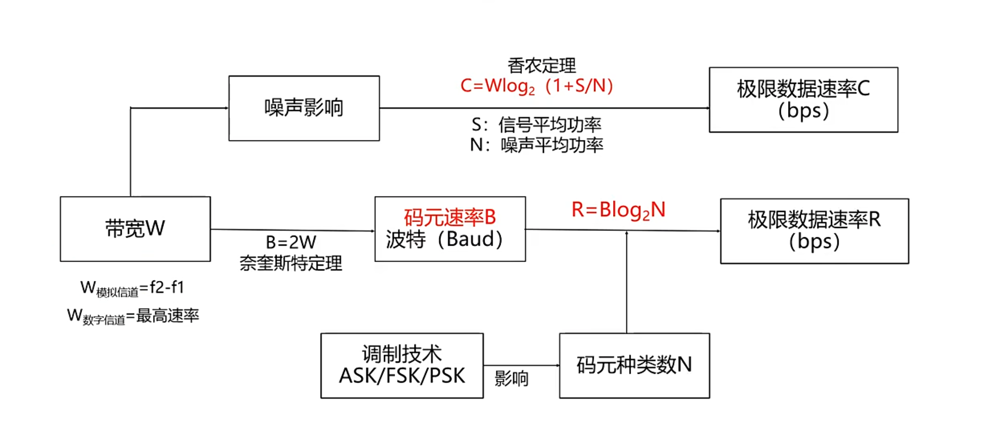
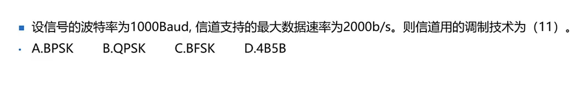
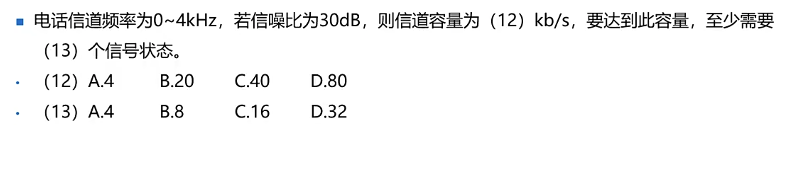
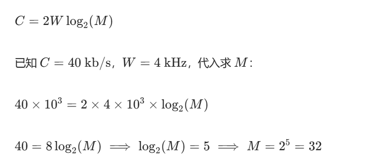

## 信道特性
数据通信概念
- 传递信息
- 产生和发送信息的一端叫信源。接受信息的一段叫信宿，信源和信宿之间的**通信线路成为信道**。


### 信道特性-信道带宽w（*）
- 模拟信道   
W=f₁-f₂ 信道能通过的最高/最低频率，单位hz



#### 码元和码元速率
``` 
码元速率 ：B=1/T （波特)
T：码元宽度
一个码元携带信息量n 与马元种类数N 关系：   
n=log_2N
- 特例
*** QPSK :N=4
*** DPSK|BPSK N=2
```
- ### 奈奎斯特定理（⭐）
在一个理想的信道力，信道带宽为W，最大码元速率为：
```
B=2W（baud）  B=2（f₁-f₂）
```
```
极限数据速率为 R=Blog_2N=2Wlog_2N
```
- 香农定理
极限速率公式：C =  Wlog_2(1+S/N)      
信噪比S/N是一个整体   
分贝与信噪比关系：dB=10log_10S/N   

## 关系梳理
又噪声影响用香农，没有则用奈奎斯特定理



##练习
传输信道频率范围10~16MHz,采用QPSK调制，支持的最大速率为多少Mbps。
***
<details>
<summary>点击展开查看隐藏内容</summary>
w= f1-f2 =6mhz   

B=2W   
qpsk的N=4 R=2log_2N=2x2x6
R=24

</details>

***

<details>
<summary>点击展开查看隐藏内容</summary>
B   
R=2000 W=1000
</details>   
***


<details>
<summary>点击展开查看隐藏内容</summary>
香农公式：C=Wlog2​(1+S/N)   

带宽 W=4 kHz   
信噪比 30 dB，先换算为线性值：10log10​(S/N)=30⟹log10​(S/N)=3⟹S/N=10^3=1000   
C=4×103×log2​(1+1000)≈4×10^3×10=40 kb/s   

-    C=2Wlog2​(M)   
-   C=40 kb/s，W=4 kHz


</details>   

*** 
在异步传输中，1位起始位，7位数据位，2位停止位，1位校验位，每秒传200字符，采用曼彻斯特编码，有效数据速率是（），最大波特率位（）
<details>
<summary>点击展开查看隐藏内容</summary>
1+7+2+1x200 = 2200   
有效数据位为7，则为7/11   
2200x7/11 = 1.4   

____________________

曼彻斯特编码中，码元速率（波特率）等于数据速率的2倍，2x2200=4400 Baud
</details>   
