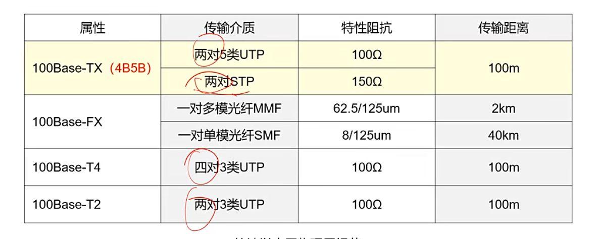
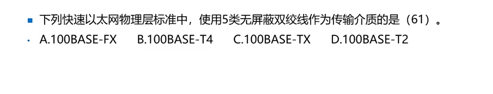
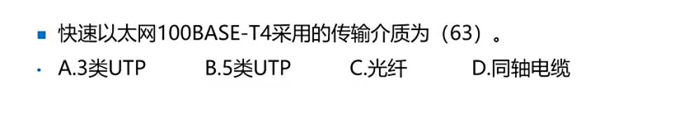
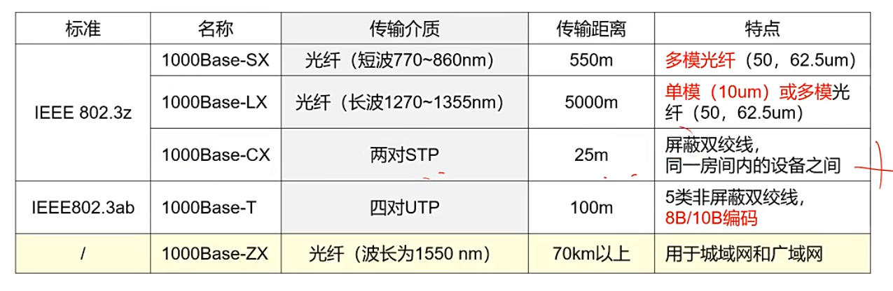
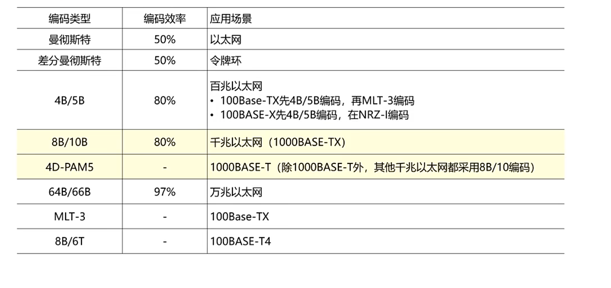
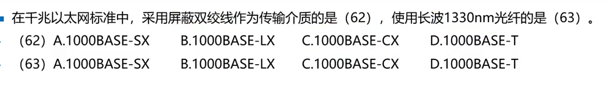
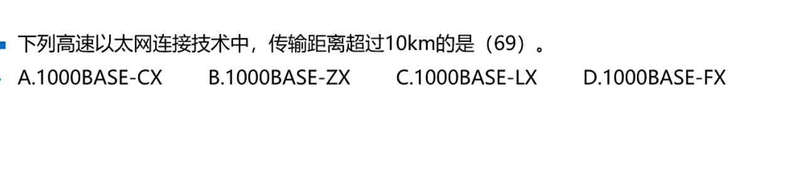
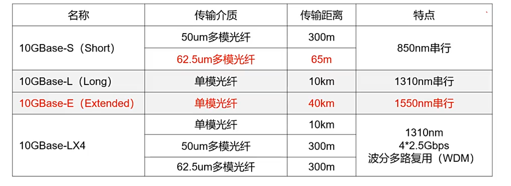
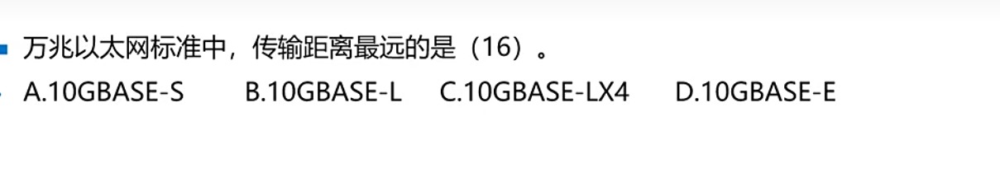

***
## IEEE 802.3 以太网（10M）
__100__ BASE T
- 100:100Mbps
- BASE:基带传输
- T：双绞线，F表示光纤，如果有5表示500m

## 快速以太网802.3u（100M百兆）
- 使用2对还是4对，采用屏蔽线还是非屏蔽线。
- UTP：非屏蔽双绞线。 STP：屏蔽双绞线
- 100Base-TX采用4B/5B编码。

### 练习

答案

C

  

*** 
****
****

答案

A

  

### 千兆以太网（1000M）⭐⭐⭐⭐
- 2个标准 __802.3z和802.ab__（1000BASE-T） , 4对双绞线 ，打到100米传输.
- 100BASE-LX标准可以使用**单模和多模**光纤传输
- 千兆以太网编码方法：4B/5B或者8B/9B

### 编码总结

### 练习

答案

C B

  

***
***

***

答案

B

  

### 万兆 以太网802.3ae（10G）
- 万兆以太网标准：IEEE802.3ae，支持10G速率，可用光纤或者双绞线 
- 点到点线路，不共享，没有冲突检测 载波监听和多路访问也不重要。
- 万兆以太网和万兆以太网采用与传统以太网同样的 __帧结构__

## 练习

答案

D

  
