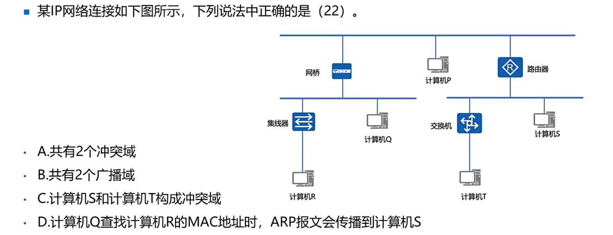
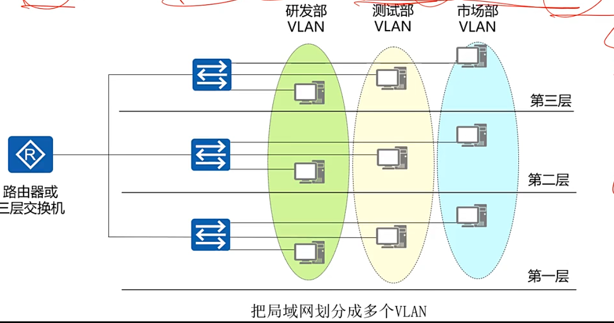
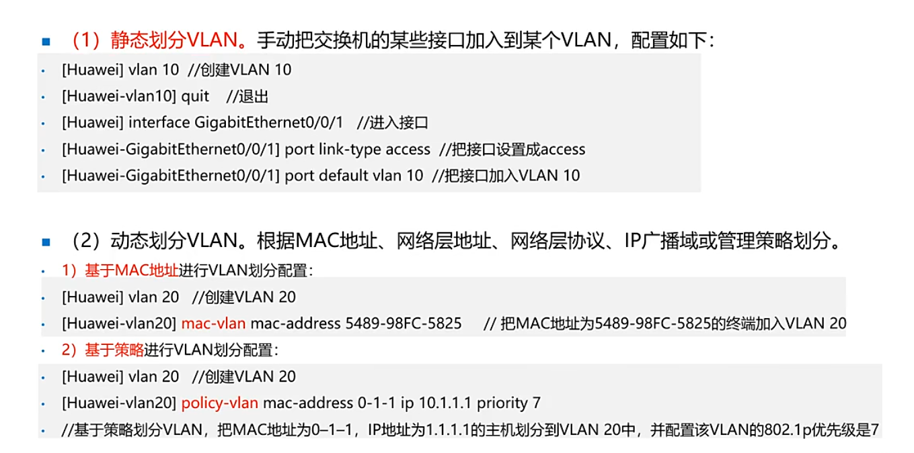
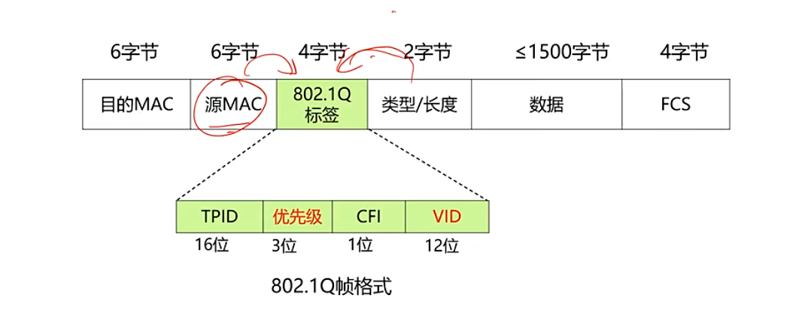
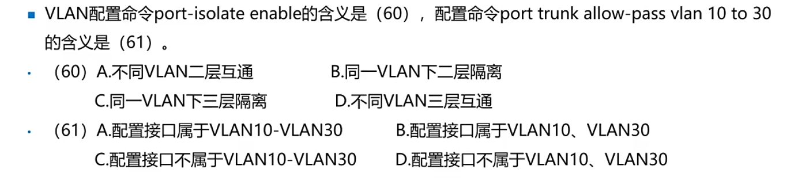

***
***
### vlan基础
- 虚拟局域网
- 根据管理功能，机构或应用类型对交换局域网进行分段而形成的<span style="color: red;">逻辑网络</span>
- VLAN通信必须经过三层设备：<span style="color: red;">路由器</span>,三层交换机，防火墙等。 （单提交换机是指：二层交换机）
```
- 冲突域和广播域：
（1）一个中继器和集线器是一个冲突域
（2）网桥/交换机的一个接口为一个冲突域
（3）一个VLAN为一个广播域，交换姬默认所有接口都在VLAN 1
```
### 冲突域
- 冲突域是指连接在同一共享介质上的说有节点的集合，**冲突域内所有节点竞争同一带宽**，一个节点发出的报文，其余节点都可以收到。
## 广播域
- 广播报文所能达到的整个范文范围称为二层广播1域，**同一广播域的主机都能收到广播报文。**
### 练习

<details>
<summary>答案</summary>
B
</details>   

### 交换机VLAN划分⭐⭐⭐⭐⭐⭐
- 静态划分VLAN：**基于交换机端口**   

- 动态划分VLAN：**基于MAC地址，基于策略，基于网络层协议，基于网络层地址**


***
***

### VLAN划分配置

### VLAN作用
- 减小冲突域，提高网络宽带的利用率。
- 安全性
- 突破地理位置限制

## 802.1Q标签⭐⭐⭐⭐
- PRI（8位）：Priority表示优先级，提供0~7八个优先级
- VID（12位）：VLAN标识符，做多可以表示$2^{12}$=4096个VLAN 其中VID 0 用于识别优先级 VID4096保留未用，**所以最多可以配置4094个CLAN，默认管理VLAN是1，不能删**
- **交换机添加删除VLAN标签是自动的，处理速度很快，不会引用太大延迟**
- VLAN标记是透明的


### 交换机端口类型
- Access：单个VLAN数据
- Trunk接口：多个VLAN
- Hybrid
- QinQ：双层标签
### 

<details>
<summary>答案</summary>
B
A
</details>    