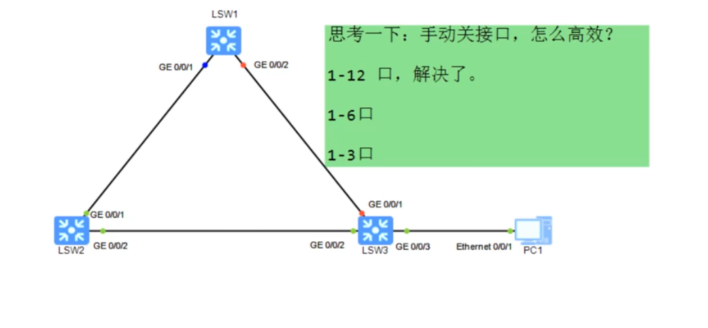
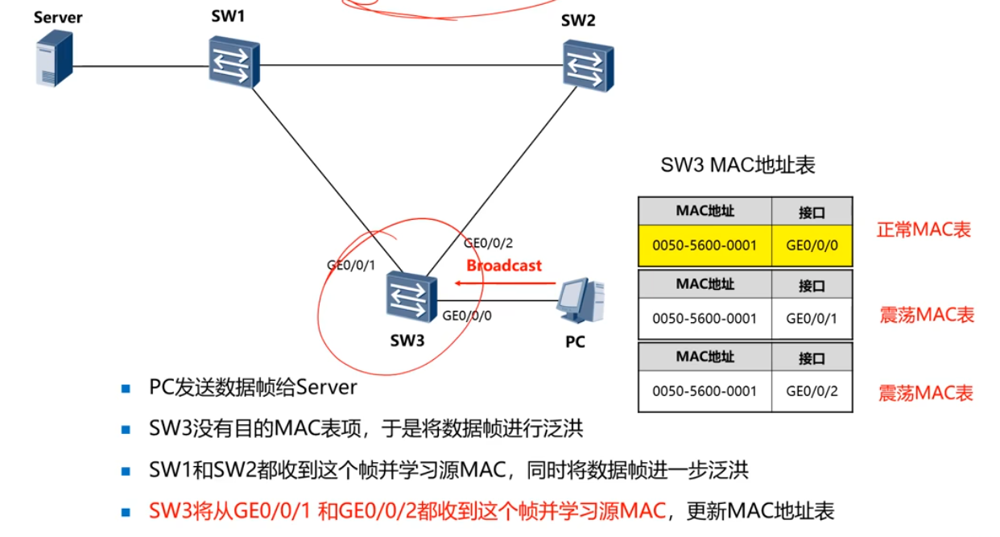

***
### 生成树技术背景
- 冗余扩扑带来了二层环路为。
- 实际网络环境中，进场产生二层环路从而引发网络故障。
### 二层环路问题-广播风暴
- 严重消耗设备CPU资源
- **网络慢，接口指示灯高速闪烁，CPU使用率高，CLI卡顿，远程管理卡。**
#### 二分法查看问题出在哪

### MAC表震荡
- **SW3将从GE0/0/1和GE0/0/2都收到这个帧并学习源MAC，更新MAC地址表**

