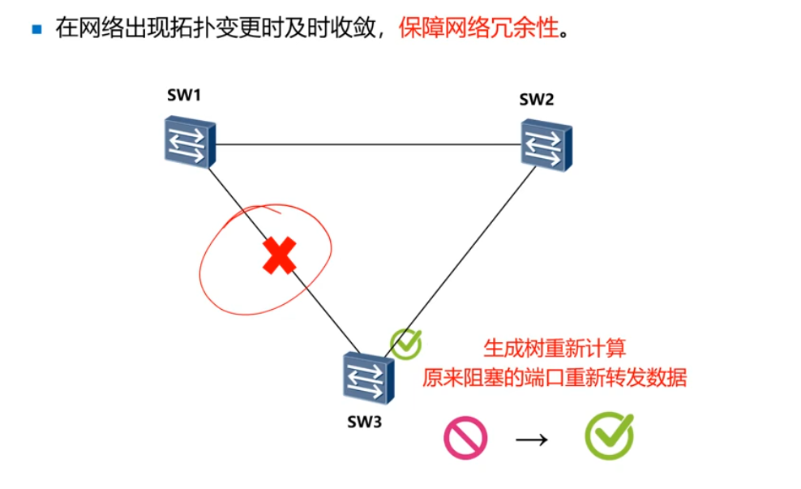
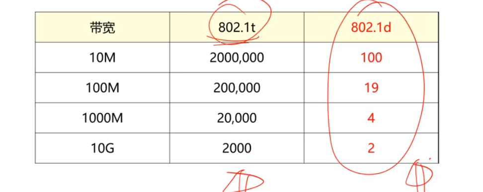
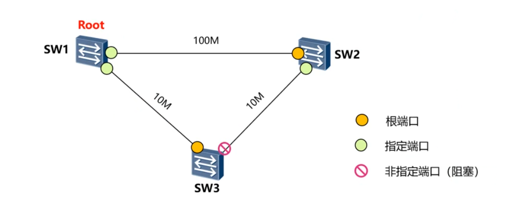
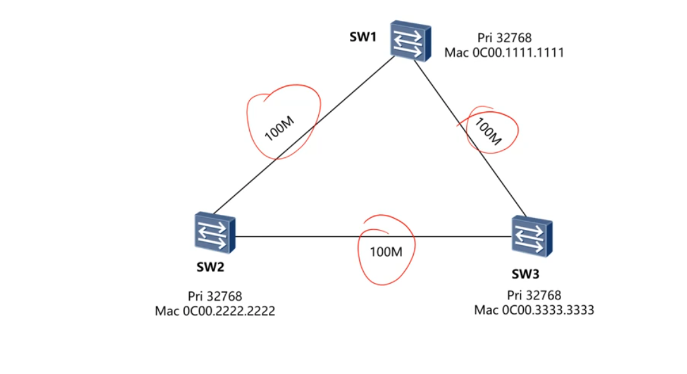
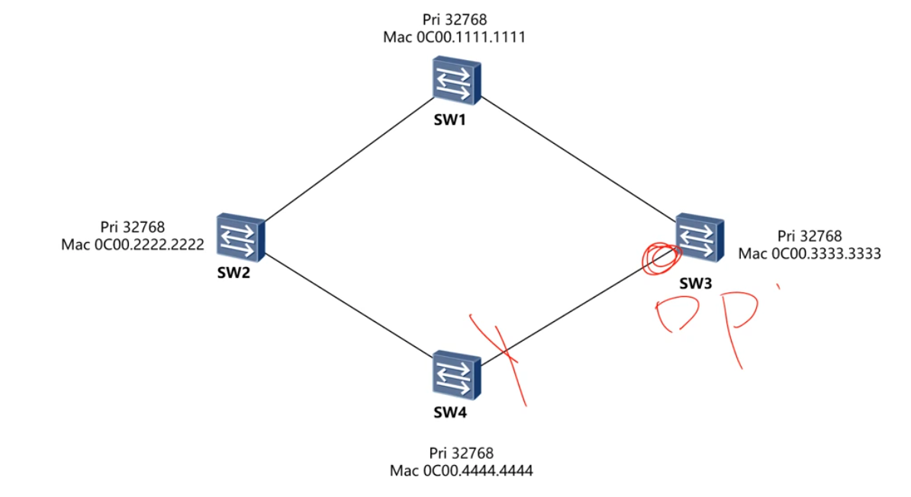
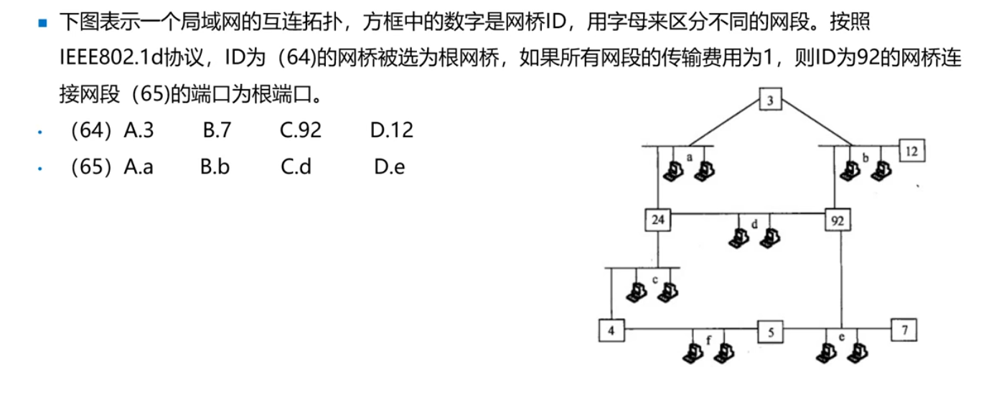
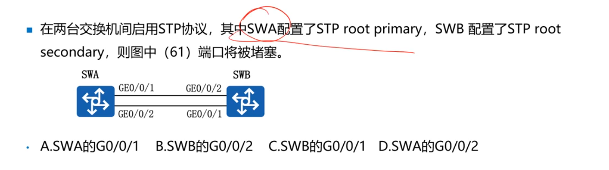
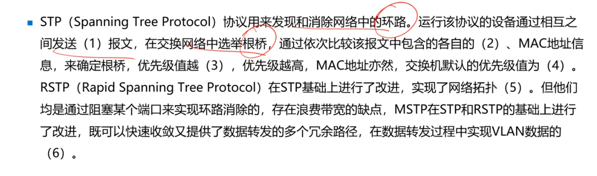
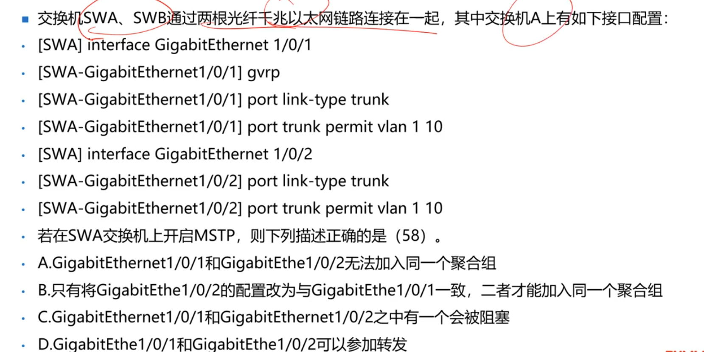
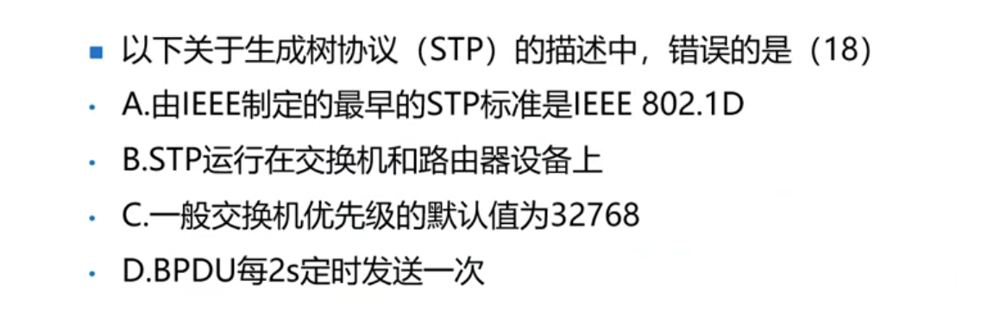

***
- 采用生成树（Spanning-tree）技术，能够在网络中存在二层环路时，通关逻辑阻塞特定端口，从而**打破环路**，**保障网络冗余性。**

### 当网络出现故障

### 网桥ID（Bridge ID）
- 8个字节，由**2个字节优先级和6个字节**的MAC地址构成
- 默认为**32768**
### 路径开销
- 路径开销与端口宽带成反比。

### STP选举操作
- 1确定根桥【选优先级和MAC地址最小的网桥】
- 2确定其他网桥的根端口【非根桥的端口到根桥最近的端口】
- 3每一个段选择一个指定端口【先选指定桥，指定桥上为指定端口】
- 4选出非指定端口

### 练习

哪个是断口？

答案

1.根桥是SW1
2.选指定桥，cost值对比，桥id小的是指定桥，DPRP
得到SW3左边的为断口

   

#### ————————————
- 还有个🌰

### 几种生成树协议
- 生成树协议：802.1d STP（慢）
- 快速生成树协议802.1w RSTP(快)
- 多生成树协议 802.1s MSTP(多个V)

#### 练习

答案

A B

  

***
***

答案

root primary是优先的意思   

根桥不会堵塞，所以比RP，选择B

  

****
***
***

答案

- BPDU
- 优先级
- 小
- 0
- 32768
- 快速收敛
- 负载分担/负载均衡

  

***
***
***

答案

影响加入聚合组：带宽不一样，开启双工模式
开启了MSTP(多协议)，端口都能用选D

  

***
***
***

答案

B，只运行在交换机上

  