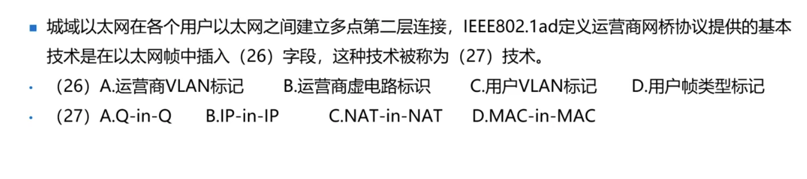
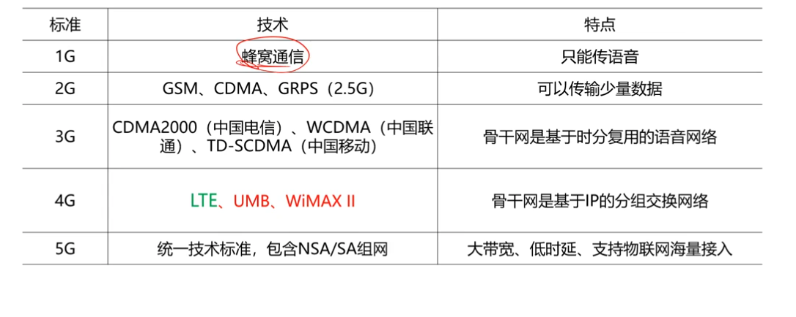
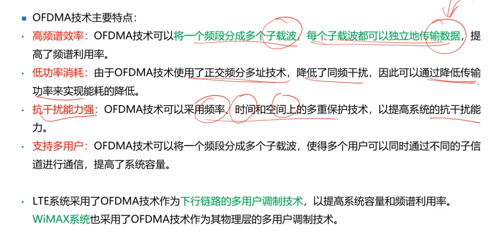
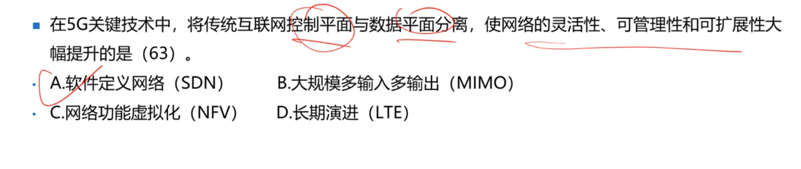

***
### 城域网 （IEEE802.1ad）
- E-LLAN技术是802.1QVlan帧标记，打了两层VLAN标签，也被称为QinQ技术。
- IEEE802.1ah也被称为PBB，**MAC-IN-MAC技术。**
### 练习

答案：  AA

### 移动通信

### 4G

- GSM →WCDMA →HSPA →4G

## OFDMA,MIMO,软件无线电，VoIP⭐⭐⭐⭐⭐
- **OFDMA技术：通过无线信道分成多个子信道，提高了频谱利用率和数据传输速率。**
- MIMO：MIMO使用过个天线来发送和接收数据，可以显著提高无线信道的容量和数据传输速率。
- 码本分集技术：添加纠错码来提高数据的可靠性
## 4G关键技术
- 软件无线电：可扩展性和适应性。
- VoIP：提高通信效率和资源利用率。
- 安全加密技术：4G安全性和用户的隐私

### OFDMA

### MIMO
- 显著提高频谱利用率和信道容量，提高素具传输的可靠性和覆盖范围。
- **MIMO主要有两种形式：空时编码空间复用**
- 空时编码：发送端将多个数据流分别编码成多个符号，通过多个天线同时发送，接收端利用接收到的符号进行解码，从而提高信道的可靠性和传输速率。
- 指利用多个天线同时发送不同的数据流，接收端通过接收到的多个数据流进行解码。
### 5G关键技术
- 超密集异构无线网络：覆盖范围较小，需要密集部署宏基站等满足覆盖需求
- 大规模输出（MIMO）
- ⭐⭐SDN和NFV

