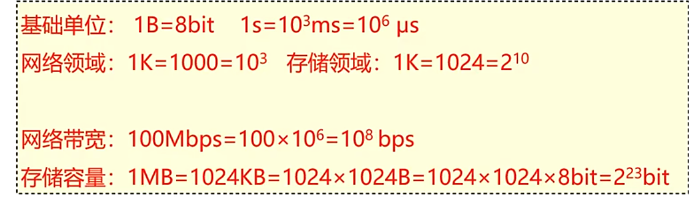
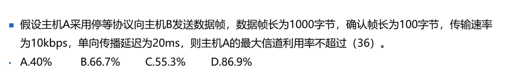

## 信道延迟
- 信道延迟=线路延迟+发送延迟
- 线路延迟=传输距离/传播速度 🌰：1000米线缆，延时5us   
发送延迟=数据帧大小/速率 比如100M线路发送1000字节数据，延时为80us（1字节=8比特）
### 信道延迟计算
在1000米100bast-T线路商，发送1000字节，延时计算过程如下：   
（1）换算单位：   
100Base-T 线路宽带是100M，即100Mbit/s=100x10^6bit/s,1000字节=1000x8bit。   
（2）发送延迟：   
1000x8bit/(100x10^6bit/s)=80x10^-5s=80us
(3)线路延迟：   
1000m/(200000km/s)=5x10^-6s=5us
(4)数据延迟：
数据延迟=发送＋线路延迟=80+5=85us
### 换算单位※※

*** 
### 练习
- 以100Mb/s以太网链接的站点A和B相距2000m，通过停等机制进行数据传输，传播速度为200/us，最高的有效传输速率为   

答案

以太网数据帧为1518字节，帧发送时间：1518*8/100Mb/s=121.44us   
帧传播时间=2000m/(200m/us)=10us
确认帧发送时间=64*8/100Mb/s=5.12us
all time=121.44+5.12us+10+10=146.56us   
有效速率=1518/all time=82.9us

  

- 

答案

发送时间1000x8/10kbps=800ms
单向传播20ms
确认帧100x8/10kbps=80ms
800/800+20+20+80=86.9%  

 
(未待完续)
