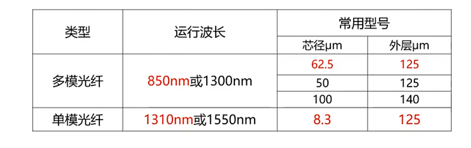
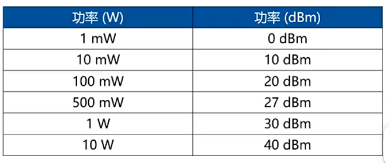

***
### 传输介质
- 两个终端，用一条能承载数据传输的传输介质连接起来，就组成了一个简单的网络。   

有线传输介质：双绞线和光纤。   

无线：微波，红外线，激光。
微波：__300Mhz~300GHz__
***
### 基带和宽带
- 通常吧数字信号方波频带称为基带
- 宽带：用于传输模拟信号。
### 非屏蔽双绞线（UTP）⭐⭐⭐
- 廉价，绝缘管无屏蔽层
- 企业，教育
### 屏蔽双绞线（STP）
- 绝缘管中外游铝铂包裹
- 贵，传输效率高
- 军队政府，医疗
## 光纤 ⭐⭐⭐
- 光纤：玻璃或者塑料纤维传导
- 损耗很低，长距离
- 重量轻，体积小，传输元，容量大，抗电磁干扰。
### 光纤分类
- 单模光纤

一种模式在其中传播，适用于大容量，长距离（贵）
- 多模光纤   

允许多种模式光信号传播。   
较小容量，短距离

## 练习
光纤通信系统中使用100mW的激光器，发射波长为1550nm时，光功率（）

答案

室内ap不高于100mW，室外不能500mW,27dbm

  

