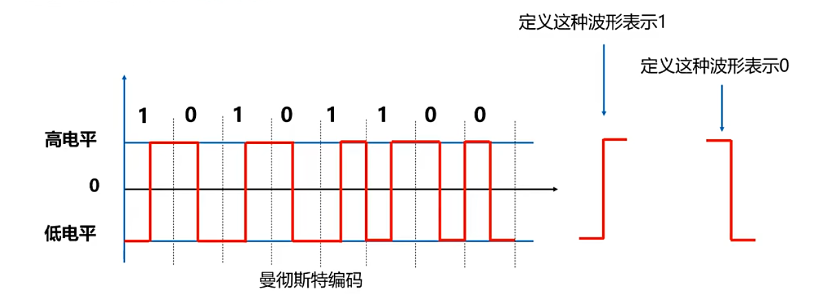
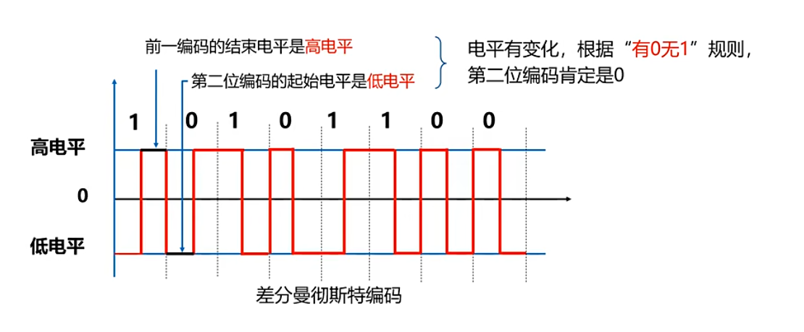
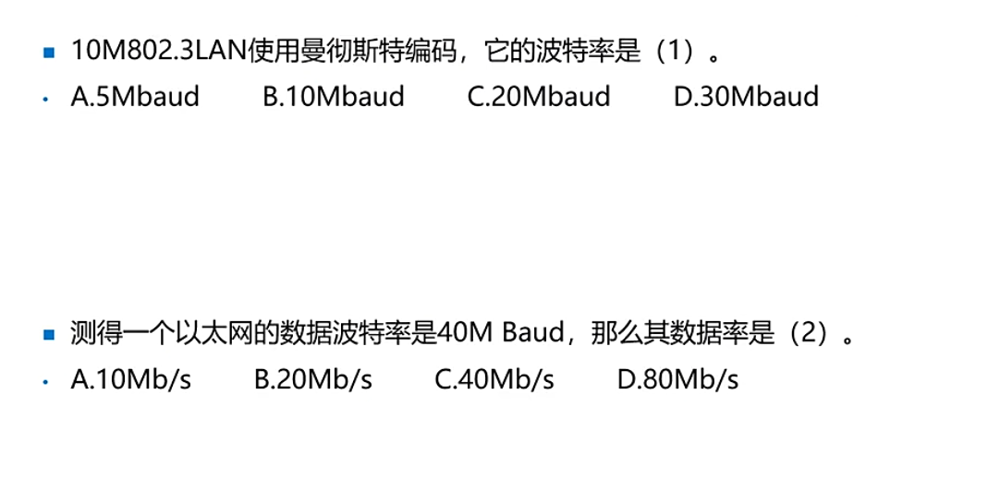
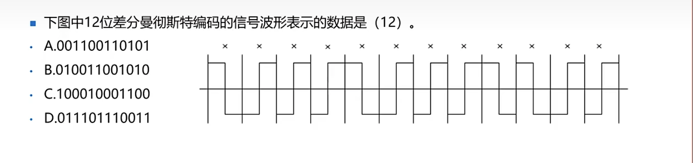

***
### 曼彻斯特编码
- 第一个编码自定义
- 用于以太网（10兆）

### 差分曼彻斯特编码⭐⭐⭐⭐
- 用于令牌环网中
- 有跳变代表“0”，无跳变代表”1“。__[有0无1]__
- 不是比较形状

## 特点
- 编码效率50%
两种 __数据速率是码元速率的一半__ ，数据传输速率为100Mbps，码元速率为200M baud.
#### 练习题

***

### 其他编码 
4B/5B：80%百兆   
8/10B：80%千兆

### 练习

答案

c

    