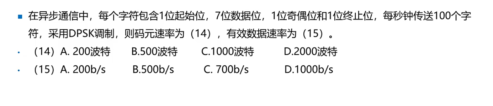
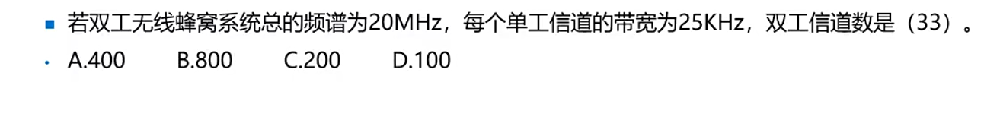
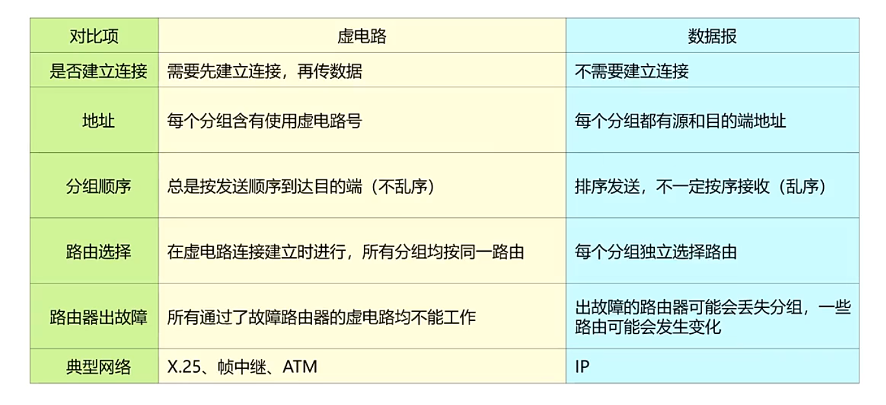
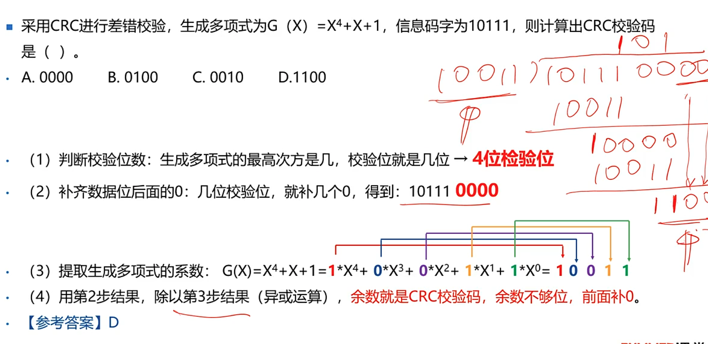
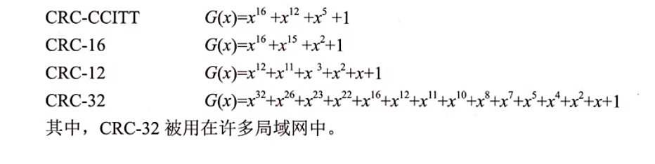
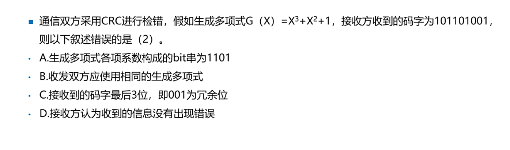

***
## 数据通信方式
- 单工通信
- 半双工通信 -对讲机/Hub
- 全双工通信 -电话/交换机

### 按同步方式分
- 异步传输和同步传输
1：异步：有起始位和停止位，优点：实现简单，但是会影响传输效率，导致速率不会太高。
2：同步：效率更高，短距离中，大多数采用。
#### 练习


<details>
<summary>答案</summary>
1+7+1+1=10个字符，每秒传输100个，10*100=1000,1000*7
有效速率：700b/s
码元速率B：R=Blog_2 N
</details>   


<details>
<summary>答案</summary>
单工25KHz，双工就50KHz,
20MHz/(50KHz)=400
</details> 

### 数据交换方式⭐⭐⭐⭐
__电路交换，保温交换和分组交换__
- 电路交换：早期电话
- 报文交换：报文从发送方传送到接受方采用存储转发方式。
- 分组交换：将数据拆分进行传送。包括：数据报和虚电路。   

数据报：每个分组被独立处理，每个节点根据路由选择算法，被独立送到目的地，路径和到达目的的顺序都可能不一样。

虚电路：在数据传输前，先建立一条逻辑上的链接，每个分组都沿着一条路径传输，不会乱序。   
⭐⭐⭐⭐


### 差错控制-
- 检错：接收方知道有差错，但是不知道发生怎么样的错误。
- 纠错：接收方知道有差错，而且知道是怎么样的错误。
### 奇偶校验
- 奇校验：“1”的个数为奇数
- 偶校验： “0”个数为偶数
### 差错控制-CRC
```计算```
```
（1）生成多项式最高次方是多少，校验位就是几位   

（2）补齐数据位后面的0：几个校验位补多少个   

（3）   提取生成多项式的系数   

（4）用1第二步结果除于第三步结果（异或计算：1÷1=0，0÷0=0，0÷1=0），

```
### 列子



### CRC 循环⭐⭐⭐
- 末尾加入CRC循环校验码能检错不能纠错
- 具有很强的检错能力，而且容易用硬件实现，用于局域网。
- CRC有可能有差错而检测不到.概率为1/256

-- __具有r个校验位的多项式能检测出说有长度小于等于r的突发性差错__
   
***

### 练习


<details>
<summary>答案</summary>
校验位：3   

码字最后3位001是冗余位   
bit串位系数，1101   
B对的
D：自己算喵


</details> 