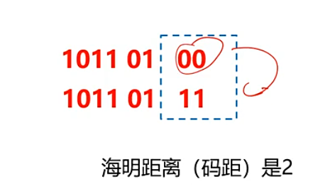
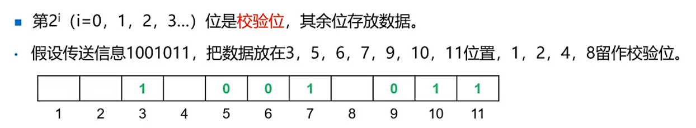
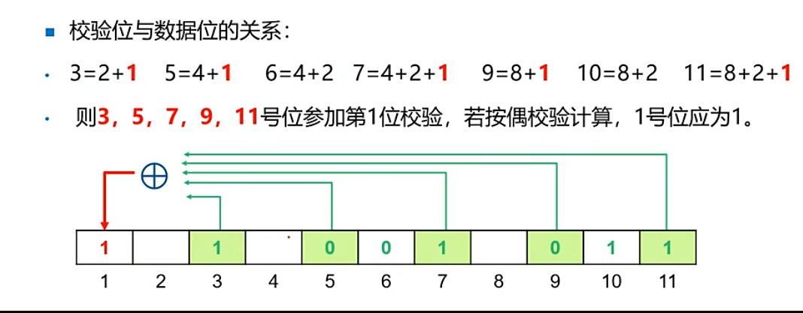
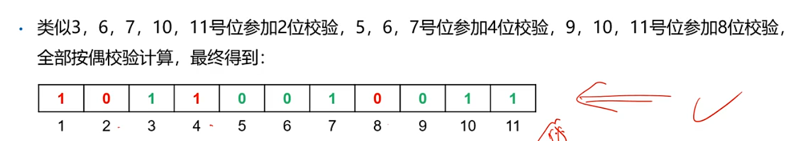
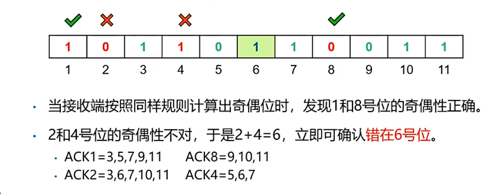
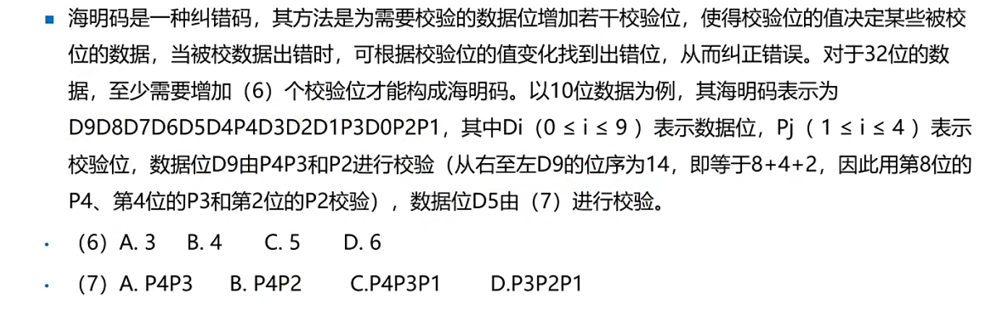
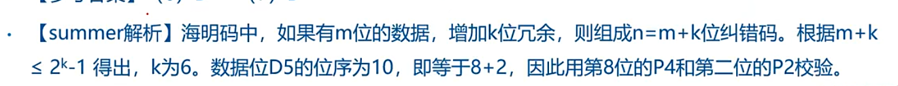
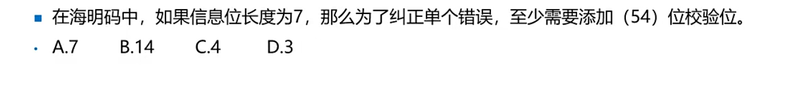
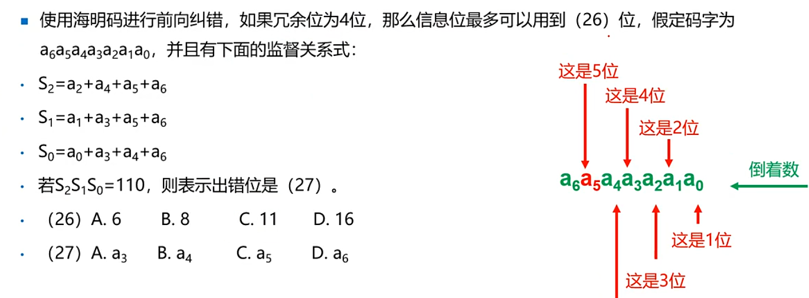
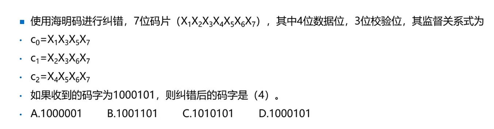

***
### 海明码
- 海明码是检测盒纠正差错的编码方式
- 海明距离：一个码子要变成另一个码字时必须改变的最小位数。两个码字之间不痛的比特数。

### 海明不等式⭐（CRC）
- 海明不等式：满足 __2^k-1≥m+k（m为信息位，m+k为编码后的数总长度__）
### 海明编码方法（1

即可补充出来结果为

只能纠正一位错误

## 练习

答案

D
B

  

***
***

答案

用海明不等式

  

***
***

答案

S总=110，转为10进制为6，表示第六位出错

***
***

答案

C0=1+0+1+0+1=1（这里是用偶数，所以得变多1个1凑偶数）
C1=0+1++0+1=0
C2=0
C123=101，结果十进制为5，第5位出错
c

