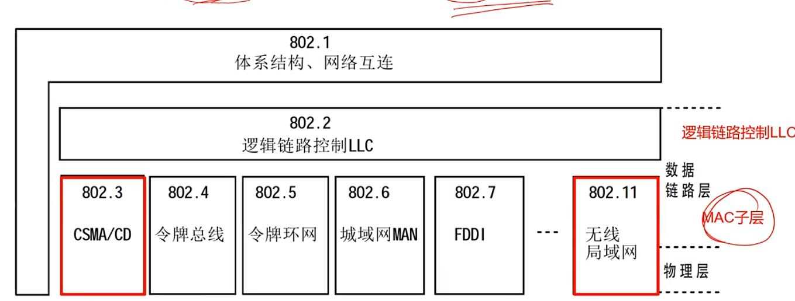
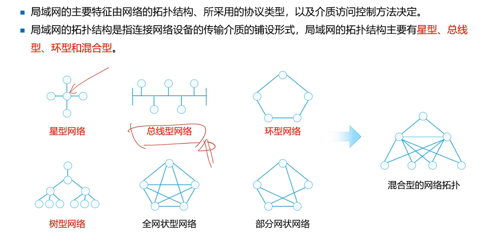
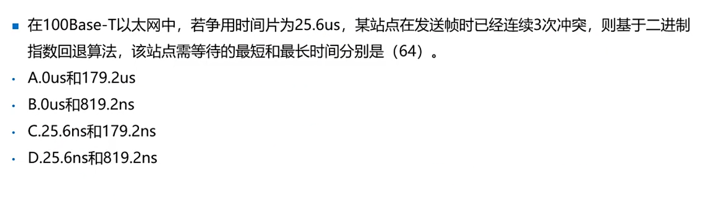

***
###  CSMA/CD
- 局域网架构IEEE



### 局域网扩扑结构


## CSMA⭐⭐
- CSMA（载波监听多路访问）
```
- 基本原理：发送数据执勤啊，先监听信道上是否有人在发送，然后根据预订策略决定：
- 是否立即发送
- 是否继续监听
```

### CSMA3种监听算法
1-坚持型：只要信道变闲，就立即发送   

2-非坚持型：如果空闲，则发送否者后退，再试   

p-坚持型：行到变闲时以概率p发送，否者延迟一个时槽   

### 冲突检测原理CD
- __载波监听只能减小冲突的概率，不能完全避免冲突__
- __冲突还继续发送，会浪费网络宽带__，采取了边发边听的检测方法
- 1.发送时期同时接受
- 3若比较结果不一样，锁门发生冲突，立即停止发送，并发送一个简短的干扰信号，
- 4发送jamming信号后，等待一段时间，重新监听发送。   
- 对总线型，星型，和树形扩扑范文控制协议是CSMA/CD
- 带冲突检测监听算法把浪费宽带的事件减少到检测冲突的时间。

### 二进制指数退避算法
等待的随机时间=征用时间*Random【0,1，...，2^k -1】
k=min【重传次数，10】，k=[12,10]=10，那么可能等待的事件是[0,1023]
### 练习


<details>
<summary>答案</summary>
A
冲突3次后，random[0,7]*25.6
</details> 