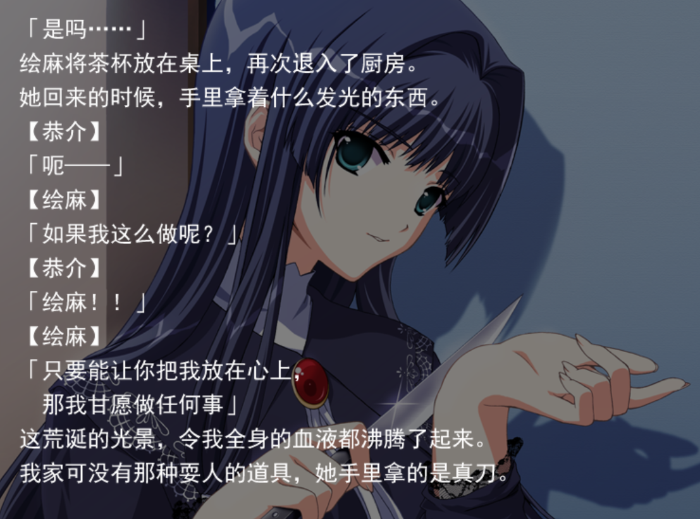

***
***
***
### 趁着工作刚开始活少清闲补一下这个摸鱼记录（）

~~可能会记录工作上的趣事，但可能的概率不会很大~~
- 准备用150个兑换拿下亚丝娜，桐人就等着戴绿帽子吧桀桀桀www


- 无聊发个病娇妹妹片段


- 其实也可以写写工作上的工作内容，但是写了感觉会心情烦躁（ 

- 我一定要出去租个房，byd室友不太像人，虽然心里有预想，但是没想到会烂成这样

### 关于我初中同学结婚邀请我五一做伴郎这档事
- 所以真的会有人这么快结婚的吗？
## ~~这可是二十一世纪啊喂！~~
- 这对我的世界观和爱情观冲击太大了
~~桀桀桀我咬爽爽吃席！终于不是那种和自己亲人长辈那种的席了~~

### 一袋哟
```
感觉好久没写自己的博客了,以为能有时间实习兼顾学习的，结果发现上完班回来没兴趣去写任何东西，感觉自己的某种东西正在一点点消失殆尽
```

### 最后这里放个霜月的琉璃鸟结尾吧
***
瑠璃の鳥 - 霜月はるか
  <iframe frameborder="no" border="0" marginwidth="0" marginheight="0" width=330 height=86 src="//music.163.com/outchain/player?type=2&id=28466084&auto=1&height=66"></iframe>
 
  ***
- 明ける空を忌み 影落とす者   
厌恶那明亮的天空 散发光芒的人
- 望むべきものは ここに無いと   
在这 应该已经没有 任何愿望了
- 踏み出した土は脆くて   
踏出的那片土地 变得脆弱
- 孤独のままに 堕ちてゆく   
逃脱 那破灭的世界 
- 儚い願いは 叶えられるはずもない   
那短暂的愿望 已经再也无法实现了
- 出でた殻は紅く染まった―   
呈现的外壳 染成了红色 
- 翳した手のひら すり抜けていく   
举起手掌 穿过悲伤
- もう動くこともない    
已经无法再动弹 

