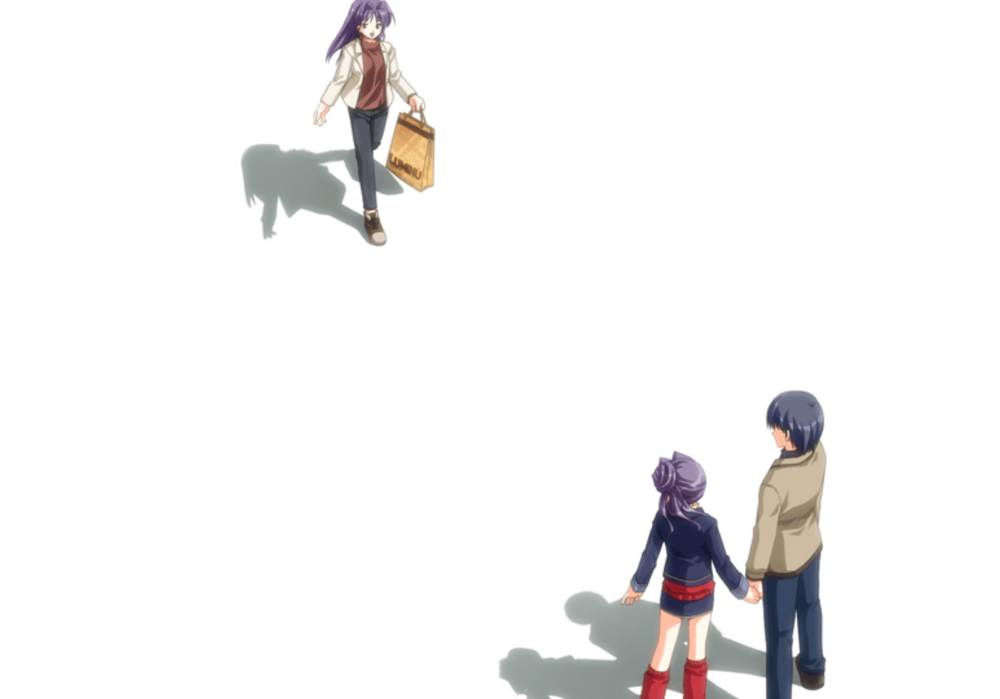
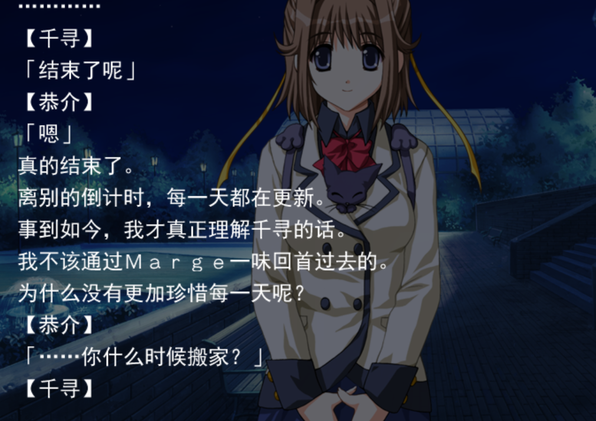
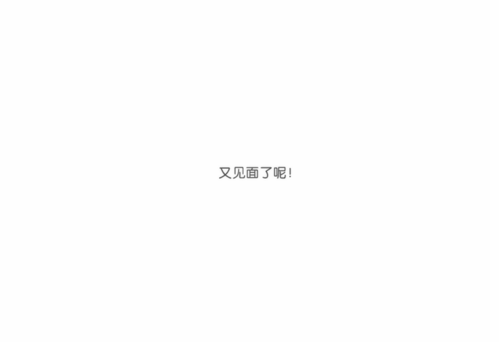

***
### 先说结论：8/10分。给到夯。（剧透警告）

这一作还是教我汉化程序的一个大佬得知的，这边感谢一下他让我挖到了宝藏

## cg，配乐满分。

全文围绕一个神奇的药物，能改变过去而创作的

放个霜月的歌在这，豪庭的钥匙

[player]https://y.music.163.com/m/song?id=34002280&amp;amp;amp;amp;amp;userid=3244384017&amp;amp;amp;amp;amp;dlt=0846[/player]

需要按顺序攻略并继承存档，否则无法完成全角色攻略推荐按照这个攻略顺序进行攻略并继承存档。

茂木一叶→麻生桐李→青井智加子→神崎千寻→国见绘麻

## 茂木一叶（最烧脑的一集）

小时候被哥哥强碱了产生了ptsd，自我保护误认为自己是姐姐一叶，然后把事实扭曲成哥哥强碱了自己的妹妹二叶。

于是无法认知现实中的“一叶”

顺带伏笔一下在妹妹线被一叶得知后无法原谅男主。

后面用小时候送的一个石头破案了，后面也是治好了与真正的一叶见面了（？）

## 麻生桐李和青井智加子

没什么特别的线，桐里hd还好，智加子和男主拔河看谁先救谁绷不住了，后面妹妹看不下去发个hd给男主

## 神崎千寻

本作真女主之一，也是妹妹以外最喜欢的人（不是男主是哇达西喵）。了解整个故事手握剧本的女人，也是引导男主珍惜每一天而不是想着回到过去改变什么。真正上的享受小时候的乐趣。

以及心里喜欢男主但不得不和男主强调，“我们一定会做好朋友的吧”。“会见面的，下次在做朋友好吗”不停发朋友的卡的屑

游玩看得出来是真的很喜欢小时候一起玩耍的日子。喜欢，会留念，但绝不会回头的人

## 国见绘麻（终于看到关系正常的兄妹了）

经历了空白事件后和妹妹组成了扭曲的关系，每天晚上do就算了，还在学校上课前用口进行输液。

反倒是进个人线后没do了。

男主人公始终试图让自己和妹妹的关系回到正轨，我是真急哭了，妹妹一心一意等着他，男主居然让暗恋妹妹的眼镜男

教他攻略自己的妹妹。妹妹拒绝了眼镜男之后男主欺骗他说“我不喜欢妹妹喜欢的人，你才是我认可的妹夫”给了眼镜男一个恶魔般的动机再次接近妹妹。

在一次眼镜男尾随看到哥哥和妹妹口服进行输液就知道，妹妹喜欢的是男主，于是在家割腕紫砂（纯出生男主，给人希望又打破人家）

事实上男主还是希望自己和妹妹的关系回到正轨拒绝了妹妹，真的看哭了

绘麻：“我爱着你哥哥”

男主：“我喜欢你妹妹”

直到妹妹线都没有臣服于妹妹的石榴裙。妹妹也是不死心，用Marge让男主得知真相，并希望男主选择她。并告敌人其实是我们可爱的千寻酱。

男主又醒来，这是一条妹妹死亡的线。没有每天的妹妹的起床服务，这是一个妹妹死亡的世界，男主选择了邻居桐李。成为男女朋友，没有千寻酱的热闹世界。没有小时候的空白事件，也没有热闹的日常。也没有能从手里放出🔥的能力。

莫名的像凉宫春日的忧伤，一切都是很正常的日子，无聊，干燥。

千寻对妹妹说：还在观测吗

后面千寻酱看不下去了。决定与男主见面再次开启白色事件（重启）

事实上我结局看不懂，太电波了，出现空白事件的是虚假的世界，但是结局并没有出现空白，可是在开头却出现了空白事件的前兆，男主无法意识到自己以外的东西。随后被妹妹叫醒。

智加子的弟弟还活着，妹妹也是存在的，一切又回到了开始。

### 感想

游戏用了第二人称。回忆过去时，玩家又会发现，人称悄然从第一人称切到第三人称。大概是为了方便脱离男主看到事情的真相而采用。

事实上很难让人不想回到过去，

但是如果真的能让我回到过去我也会和男主一样果决的选择回到过去，但并不是为了钱和爱情，仅仅是像歌剧少女中的芭娜娜一样重新经历一次快乐的时光。我和男主一样有着童年一群小伙伴在镇上到处偷番薯烤番薯被人抓到，骑着老式的自行车到处冒险，在公路上骑行2小时跑去隔壁镇被吓哭然后屁颠屁颠跑回家，放学留在学校与好朋友玩躲猫猫等等的事情。很难让人不想回到过去，回到那个没有学业烦恼，没有工作压力，可以安心玩的日子。

文笔很不错，主角小时候与伙伴出去玩也和夏日口袋一样字字勾起我的怀念。但全文是希望能够放弃对往日的留念，而是珍惜现在每一天。长期服用Marge的会一觉不醒，其实也是暗示了留念过去止步不前是一个死路。

真该死！妹控毒药！~~地狱笑话之妹线是和妹妹分手~~

【千寻】

「结束了呢」

【恭介】

「嗯」

真的结束了

离别的倒计时，每一天都在更新

事到如今，我才真正理解千寻的话

我不该通过Marge一味回首过去的

为什么没有更加珍惜每一天呢？